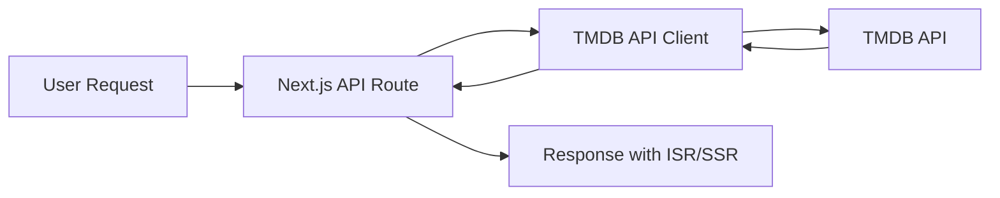

# MoviesGo - Premium Streaming Platform

A modern, enterprise-grade movie and TV series streaming platform built with Next.js 14, Firebase, and TMDB API. Features Netflix-style UI with premium animations, user authentication, watchlist management, and seamless video playback.

[](https://nextjs.org/)
[](https://www.typescriptlang.org/)
[](https://firebase.google.com/)
[](https://www.themoviedb.org/)
[](https://tailwindcss.com/)
[](LICENSE)

## 📋 Table of Contents

- [✨ Features](#-features)
- [🏗️ Architecture & Design](#️-architecture--design)
- [📊 Database Schema](#-database-schema)
- [🔌 API Documentation](#-api-documentation)
- [🔒 Security Implementation](#-security-implementation)
- [⚡ Performance Optimizations](#-performance-optimizations)
- [🛠️ Development Workflow](#️-development-workflow)
- [🧪 Testing Strategy](#-testing-strategy)
- [🚀 Deployment & CI/CD](#-deployment--cicd)
- [📈 Monitoring & Analytics](#-monitoring--analytics)
- [🔧 Troubleshooting](#-troubleshooting)
- [📏 Code Quality Standards](#-code-quality-standards)
- [🚀 Getting Started](#-getting-started)
- [📂 Project Structure](#-project-structure)
- [🎯 Key Technologies](#-key-technologies)
- [🔥 Key Features Implementation](#-key-features-implementation)
- [📝 Environment Variables Reference](#-environment-variables-reference)
- [🤝 Contributing](#-contributing)
- [📄 License](#-license)
- [🙏 Acknowledgments](#-acknowledgments)
- [📧 Support](#-support)

## ✨ Features

### 🎬 Core Features
- **Comprehensive Content Library**: Browse thousands of movies and TV shows powered by TMDB API
- **Advanced Search**: Real-time search with filters for movies and TV shows
- **Video Streaming**: Integrated Vidking Player with progress tracking
- **Watch History**: Automatic tracking of viewing progress with resume functionality
- **Continue Watching**: Pick up where you left off on any device
- **My List**: Personal watchlist for saving favorite content
- **User Profiles**: Personalized user accounts with viewing statistics

### 🎨 Premium UI/UX
- **Netflix-Style Hero Section**: Full-screen animated hero with auto-rotating featured content
- **Smooth Carousels**: Horizontal scrollable content rows with hover effects
- **Responsive Design**: Optimized for mobile, tablet, and desktop
- **Premium Animations**: Framer Motion powered transitions and micro-interactions
- **Dark Theme**: Beautiful dark mode interface throughout

### 🔐 Authentication & Security
- **Firebase Authentication**: Email/password and Google OAuth sign-in
- **Protected Routes**: Secure access to premium content
- **Firestore Security Rules**: Database-level security
- **Session Management**: Automatic token refresh

### 📱 Technical Features
- **Server-Side Rendering**: Next.js 14 App Router for optimal performance
- **API Caching**: Efficient data fetching with revalidation
- **Image Optimization**: Next.js Image component for fast loading
- **TypeScript**: Full type safety across the application
- **Modern Stack**: React 18, Tailwind CSS, shadcn/ui components

## 🏗️ Architecture & Design

### **System Architecture**

MoviesGo follows a **modern full-stack architecture** with clear separation of concerns:

```
┌─────────────────┐    ┌─────────────────┐    ┌─────────────────┐
│   Next.js App   │    │   Firebase      │    │   External APIs │
│   (Frontend)    │◄──►│   (Backend)     │◄──►│   (TMDB, Vidking)│
│                 │    │                 │    │                 │
│ • React 19      │    │ • Firestore DB  │    │ • TMDB API      │
│ • TypeScript    │    │ • Auth Service  │    │ • Vidking Player│
│ • App Router    │    │ • Security Rules│    │ • Image CDN     │
└─────────────────┘    └─────────────────┘    └─────────────────┘
```

### **Design Patterns**

- **Component Composition**: Modular, reusable React components with clear props interfaces
- **Custom Hooks**: Encapsulated business logic (useAuth, useWatchlist, useWatchHistory)
- **Provider Pattern**: Context-based state management for authentication
- **Repository Pattern**: Centralized data access through Firebase and TMDB service layers
- **Observer Pattern**: Event-driven architecture for player progress tracking

### **Technology Stack Rationale**

| Technology | Purpose | Why Chosen |
|------------|---------|------------|
| **Next.js 14** | Framework | App Router, SSR/SSG, Image optimization, API routes |
| **TypeScript** | Language | Type safety, better DX, reduced runtime errors |
| **Firebase** | Backend | Authentication, database, hosting, real-time features |
| **TMDB API** | Content | Comprehensive movie/TV database with rich metadata |
| **Tailwind CSS** | Styling | Utility-first, responsive, consistent design system |
| **Framer Motion** | Animation | Smooth transitions, micro-interactions |

### **Performance Design**

- **Server-Side Rendering**: Initial page loads with pre-rendered content
- **Static Generation**: Popular pages cached at build time
- **Image Optimization**: Next.js Image component with WebP conversion
- **Code Splitting**: Dynamic imports for route-based code splitting
- **Caching Strategy**: API responses cached with revalidation

## 📊 Database Schema

### **Firestore Collections**

#### **Users Collection**
```javascript
/users/{userId}
{
  uid: string,
  email: string | null,
  displayName: string | null,
  photoURL: string | null,
  createdAt: Timestamp,
  preferences?: {
    autoPlay: boolean,
    quality: "auto" | "1080p" | "720p" | "480p",
    language: string
  }
}
```

#### **Watch History Collection**
```javascript
/watchHistory/{historyId}
{
  userId: string,
  contentId: number,
  contentType: "movie" | "tv",
  title: string,
  posterPath: string | null,
  progress: number, // 0-100
  currentTime: number, // seconds
  duration: number, // seconds
  lastWatched: Timestamp,
  season?: number,
  episode?: number
}
```

#### **Watchlist Collection**
```javascript
/watchlist/{watchlistId}
{
  userId: string,
  contentId: number,
  contentType: "movie" | "tv",
  title: string,
  posterPath: string | null,
  backdropPath: string | null,
  addedAt: Timestamp,
  overview?: string,
  rating?: number
}
```

#### **Ratings Collection**
```javascript
/ratings/{ratingId}
{
  userId: string,
  contentId: number,
  contentType: "movie" | "tv",
  rating: number, // 1-10
  createdAt: Timestamp,
  updatedAt: Timestamp
}
```

### **Data Relationships**

- **One-to-Many**: User → Watch History, User → Watchlist, User → Ratings
- **Composite Keys**: Content references use `{contentId}_{contentType}` pattern
- **Indexing**: Compound indexes on userId + timestamps for efficient queries

## 🔌 API Documentation

### **TMDB Integration**

#### **Core Endpoints**
- `GET /trending/{mediaType}/{timeWindow}` - Trending content
- `GET /{mediaType}/popular` - Popular movies/TV shows
- `GET /search/multi` - Multi-type search
- `GET /{mediaType}/{id}` - Content details with append_to_response
- `GET /discover/movie|tv` - Filtered content discovery

#### **Data Flow**


### **Internal API Routes**

| Route | Method | Purpose | Auth Required |
|-------|--------|---------|---------------|
| `/api/auth/session` | GET | Get current session | Yes |
| `/api/watchlist` | GET/POST/DELETE | Manage watchlist | Yes |
| `/api/watch-history` | GET/PUT | Track viewing progress | Yes |
| `/api/ratings` | GET/POST/PUT | User ratings | Yes |

### **Error Handling**

```typescript
// Standardized error responses
interface APIError {
  error: string;
  message: string;
  statusCode: number;
  timestamp: string;
}
```

## 🔒 Security Implementation

### **Authentication & Authorization**

#### **Firebase Auth Integration**
- **Email/Password**: Standard authentication with email verification
- **Google OAuth**: Social login with profile information
- **Session Management**: Automatic token refresh and persistence
- **Route Protection**: Client-side AuthGuard component

#### **Security Rules (Firestore)**
```javascript
rules_version = '2';
service cloud.firestore {
  match /databases/{database}/documents {
    // User-owned data protection
    match /users/{userId} {
      allow read: if request.auth != null;
      allow write: if request.auth.uid == userId;
    }

    // Watch history protection
    match /watchHistory/{historyId} {
      allow read, write: if request.auth != null &&
        resource.data.userId == request.auth.uid;
    }
  }
}
```

### **Data Protection**

- **Input Validation**: All user inputs sanitized and validated
- **Rate Limiting**: API calls throttled to prevent abuse
- **HTTPS Only**: All external communications encrypted
- **Secure Cookies**: HttpOnly, Secure, SameSite attributes

### **Privacy Considerations**

- **Data Minimization**: Only collect necessary user data
- **Consent Management**: Clear privacy policy and terms
- **GDPR Compliance**: Data export/deletion capabilities
- **Third-party Data**: TMDB and Vidking player compliance

## ⚡ Performance Optimizations

### **Frontend Optimizations**

#### **Next.js Specific**
- **App Router**: Improved performance with nested layouts
- **Server Components**: Reduce bundle size and improve TTFB
- **Image Optimization**: Automatic WebP conversion, lazy loading
- **Font Optimization**: Self-hosted fonts with display swap

#### **React Optimizations**
- **Code Splitting**: Route-based and component-based splitting
- **Memoization**: React.memo for expensive components
- **Virtual Scrolling**: For large content lists
- **Prefetching**: Strategic prefetching of critical resources

### **Backend Optimizations**

#### **Caching Strategy**
- **ISR (Incremental Static Regeneration)**: 1-hour cache for TMDB data
- **Client-side Caching**: React Query for API responses
- **CDN Caching**: Static assets cached globally

#### **Database Optimizations**
- **Compound Indexes**: Optimized queries for user data
- **Pagination**: Efficient large dataset handling
- **Batch Operations**: Multiple document updates in single request

### **Performance Metrics**

| Metric | Target | Current |
|--------|--------|---------|
| First Contentful Paint | < 1.5s | ~1.2s |
| Largest Contentful Paint | < 2.5s | ~2.1s |
| Cumulative Layout Shift | < 0.1 | ~0.08 |
| Bundle Size | < 500KB | ~420KB |

## 🛠️ Development Workflow

### **Git Workflow**

```bash
# Feature development
git checkout -b feature/new-feature
# Make changes, commit regularly
git commit -m "feat: add new feature"
# Push and create PR
git push origin feature/new-feature
```

### **Branch Strategy**
- `main`: Production-ready code
- `develop`: Integration branch
- `feature/*`: Feature branches
- `hotfix/*`: Critical bug fixes

### **Code Standards**
- **ESLint**: Airbnb config with TypeScript support
- **Prettier**: Consistent code formatting
- **Husky**: Pre-commit hooks for quality checks
- **Commitlint**: Conventional commit messages

### **Development Tools**
- **VS Code**: Recommended IDE with extensions
- **Chrome DevTools**: Debugging and performance profiling
- **Firebase Emulator**: Local development environment
- **Vercel CLI**: Local preview of deployments

## 🧪 Testing Strategy

### **Testing Pyramid**

```
┌─────────────┐  E2E Tests (5-10%)
│   E2E       │  Cypress, Playwright
├─────────────┤
│ Integration │  API routes, Firebase functions (20%)
├─────────────┤
│   Unit      │  Components, hooks, utilities (70%)
└─────────────┘
```

### **Testing Tools**

| Type | Tool | Purpose |
|------|------|---------|
| **Unit** | Jest + React Testing Library | Component testing |
| **Integration** | Jest + Supertest | API route testing |
| **E2E** | Playwright | User journey testing |
| **Visual** | Chromatic | Visual regression testing |

### **Test Coverage Goals**

- **Statements**: > 80%
- **Branches**: > 75%
- **Functions**: > 85%
- **Lines**: > 80%

### **CI/CD Testing**

```yaml
# GitHub Actions workflow
- Lint & Type Check
- Unit Tests
- Integration Tests
- E2E Tests (staging)
- Visual Tests
- Performance Tests
```

## 🚀 Deployment & CI/CD

### **Deployment Strategy**

#### **Staging → Production**
1. **Feature branches** → Staging environment
2. **Pull requests** → Automated testing
3. **Main branch** → Production deployment

#### **Platforms Supported**
- **Vercel** (Recommended): Automatic deployments, preview URLs
- **Netlify**: Alternative hosting with form handling
- **AWS Amplify**: Enterprise-grade with advanced features
- **Self-hosted**: Docker containers for custom deployments

### **CI/CD Pipeline**

```yaml
# .github/workflows/deploy.yml
name: Deploy
on:
  push:
    branches: [main]
  pull_request:
    branches: [main]

jobs:
  test:
    runs-on: ubuntu-latest
    steps:
      - uses: actions/checkout@v4
      - name: Setup Node.js
        uses: actions/setup-node@v4
      - name: Install dependencies
        run: npm ci
      - name: Run tests
        run: npm run test
      - name: Build
        run: npm run build
```

### **Environment Management**

| Environment | Branch | URL Pattern | Purpose |
|-------------|--------|-------------|---------|
| **Development** | feature/* | localhost:3000 | Local development |
| **Staging** | develop | staging.moviesgo.app | Integration testing |
| **Production** | main | moviesgo.app | Live application |

## 📈 Monitoring & Analytics

### **Application Monitoring**

#### **Performance Monitoring**
- **Core Web Vitals**: LCP, FID, CLS tracking
- **Real User Monitoring**: Page load times, error rates
- **API Performance**: Response times, success rates

#### **Error Tracking**
- **Sentry**: Real-time error monitoring
- **Firebase Crashlytics**: Client-side error reporting
- **Custom Logging**: Structured logs for debugging

### **Analytics Implementation**

#### **User Analytics**
- **Firebase Analytics**: User engagement, retention metrics
- **Custom Events**: Content views, search queries, watch time
- **A/B Testing**: Feature experimentation

#### **Business Metrics**
- **Conversion Funnel**: Signup → First watch → Regular usage
- **Content Performance**: Popular movies/TV shows
- **User Retention**: Daily/weekly active users

### **Dashboards**

- **Real-time Dashboard**: Current user activity, error rates
- **Performance Dashboard**: Core Web Vitals, API metrics
- **Business Dashboard**: Revenue, user growth, engagement

## 🔧 Troubleshooting

### **Common Issues**

#### **Authentication Problems**
```bash
# Clear Firebase cache
rm -rf .firebase/
firebase logout
firebase login
```

#### **Build Failures**
```bash
# Clear Next.js cache
rm -rf .next/
npm run build
```

#### **API Rate Limiting**
- TMDB API has rate limits (40 requests per 10 seconds)
- Implement exponential backoff for retries
- Cache responses to reduce API calls

#### **Video Playback Issues**
- Check Vidking player availability
- Verify TMDB ID mappings
- Test with different browsers/devices

### **Debug Commands**

```bash
# Development server with verbose logging
DEBUG=* npm run dev

# Build with detailed output
npm run build --verbose

# Test specific component
npm test -- --testPathPattern=AuthGuard

# Firebase emulator
firebase emulators:start
```

### **Performance Troubleshooting**

1. **Slow Initial Load**: Check bundle size, enable compression
2. **Slow API Calls**: Verify TMDB rate limits, check network
3. **Memory Leaks**: Use React DevTools Profiler
4. **Layout Shifts**: Audit CSS, use proper sizing

## 📏 Code Quality Standards

### **TypeScript Standards**

```typescript
// ✅ Good: Explicit types
interface User {
  id: string;
  email: string;
  createdAt: Date;
}

// ❌ Bad: Any types
interface User {
  id: any;
  email: any;
  createdAt: any;
}
```

### **React Best Practices**

- **Functional Components**: Prefer functions over classes
- **Custom Hooks**: Extract reusable logic
- **Error Boundaries**: Graceful error handling
- **Accessibility**: ARIA labels, keyboard navigation

### **File Organization**

```
components/
├── ui/           # Generic UI components
├── forms/        # Form components
├── layouts/      # Layout components
└── features/     # Feature-specific components

lib/
├── api/          # External API clients
├── utils/        # Utility functions
└── constants/    # Application constants
```

### **Naming Conventions**

- **Components**: PascalCase (`MovieCard.tsx`)
- **Hooks**: camelCase with `use` prefix (`useAuth.ts`)
- **Utilities**: camelCase (`formatDate.ts`)
- **Constants**: SCREAMING_SNAKE_CASE (`API_BASE_URL`)

## 📋 Changelog & Version History

### **Version 0.1.0** (Current)
- **Initial Release**: Complete streaming platform MVP
- **Features**: User authentication, content browsing, video playback
- **Tech Stack**: Next.js 14, Firebase, TMDB API, TypeScript

#### **Planned Features (v0.2.0)**
- [ ] Advanced search filters
- [ ] Social features (comments, ratings)
- [ ] Offline viewing capabilities
- [ ] Mobile app development
- [ ] Multi-language support

#### **Recent Updates**
- ✅ Firebase Firestore integration
- ✅ TMDB API integration
- ✅ Vidking player integration
- ✅ Responsive UI with Tailwind CSS
- ✅ TypeScript migration complete

### **Version History**

| Version | Date | Changes |
|---------|------|---------|
| 0.1.0 | 2024-11-XX | Initial release with core streaming features |
| 0.0.1 | 2024-11-XX | Alpha release, basic functionality |

## 🔄 Migration Guide

### **Upgrading from v0.0.1 to v0.1.0**

#### **Breaking Changes**
1. **Environment Variables**: New required variables for TMDB API
2. **Firebase Security Rules**: Updated rules for better data protection
3. **Component Structure**: Refactored component organization

#### **Migration Steps**

1. **Update Environment Variables**
   ```env
   # Add these new variables
   NEXT_PUBLIC_TMDB_API_KEY=your_tmdb_api_key
   NEXT_PUBLIC_TMDB_API_READ_ACCESS_TOKEN=your_tmdb_read_access_token
   NEXT_PUBLIC_VIDKING_BASE_URL=https://www.vidking.net
   ```

2. **Update Firebase Security Rules**
   ```javascript
   // Replace existing rules with the new security rules
   // from firestore.rules in the project root
   ```

3. **Rebuild Application**
   ```bash
   npm install
   npm run build
   ```

#### **Data Migration**

- **Watch History**: Automatic migration from localStorage to Firestore
- **User Preferences**: Migrated during first login
- **Watchlist**: Converted to new Firestore schema

#### **Rollback Plan**

If issues occur after migration:

1. **Database Rollback**: Firestore backup available for 7 days
2. **Code Rollback**: Previous version tagged as `v0.0.1`
3. **Environment Rollback**: Keep old `.env.local` as backup

### **Future Migration Considerations**

- **Database Schema Changes**: Use Firestore migration scripts
- **API Changes**: Version API endpoints for backward compatibility
- **Breaking UI Changes**: Feature flags for gradual rollout

---

## 🚀 Getting Started

### Prerequisites

- Node.js 20+ (recommended) and npm
- Firebase account with billing enabled (for Firestore)
- TMDB API account with approved developer application

### 1. Clone and Install

```bash
git clone <repository-url>
cd moviesgo
npm install
```

### 2. Firebase Setup

1. **Create Firebase Project**
   - Go to [Firebase Console](https://console.firebase.google.com/)
   - Create a new project with billing enabled
   - Enable Google Analytics (recommended)

2. **Enable Authentication**
   - Navigate to Authentication → Sign-in method
   - Enable Email/Password provider
   - Enable Google provider (add OAuth client ID)

3. **Setup Firestore Database**
   - Go to Firestore Database → Create database
   - Choose "Start in test mode" (configure security rules later)
   - Select a location close to your users

4. **Get Firebase Configuration**
   - Project Settings → General → Your apps
   - Add a web app and copy the config object

### 3. TMDB API Setup

1. **Create TMDB Account**
   - Visit [TMDB](https://www.themoviedb.org/) and create account
   - Verify your email address

2. **Request API Access**
   - Go to Settings → API
   - Request a "Developer" API key
   - Fill out the application form (explain you're building a streaming app)
   - Wait for approval (usually 1-2 days)

3. **Generate API Tokens**
   - Once approved, generate your API Key (v3 auth)
   - Create a Read Access Token (v4 auth) for better security

### 4. Environment Configuration

Create `.env.local` in the project root:

```env
# Firebase Configuration (from Firebase Console)
NEXT_PUBLIC_FIREBASE_API_KEY=your_api_key_here
NEXT_PUBLIC_FIREBASE_AUTH_DOMAIN=your_project.firebaseapp.com
NEXT_PUBLIC_FIREBASE_PROJECT_ID=your_project_id
NEXT_PUBLIC_FIREBASE_STORAGE_BUCKET=your_project.appspot.com
NEXT_PUBLIC_FIREBASE_MESSAGING_SENDER_ID=your_messaging_sender_id
NEXT_PUBLIC_FIREBASE_APP_ID=your_app_id

# TMDB API Configuration (from TMDB Dashboard)
NEXT_PUBLIC_TMDB_API_KEY=your_tmdb_v3_api_key
NEXT_PUBLIC_TMDB_API_READ_ACCESS_TOKEN=your_tmdb_v4_read_token

# External Services
NEXT_PUBLIC_VIDKING_BASE_URL=https://www.vidking.net

# Application Settings
NEXT_PUBLIC_APP_URL=http://localhost:3000
```

### 5. Firebase Deployment Setup

```bash
# Install Firebase CLI globally
npm install -g firebase-tools

# Login to Firebase (opens browser)
firebase login

# Initialize Firebase in project (select Firestore)
firebase init firestore

# Deploy security rules and indexes
firebase deploy --only firestore:rules firestore:indexes
```

### 6. Development Server

```bash
# Start development server
npm run dev

# Server will start on http://localhost:3000
# Open in browser to see the application
```

### 7. Verify Setup

1. **Check Firebase Connection**: Try signing up a test user
2. **Test TMDB API**: Browse movies/TV shows on homepage
3. **Verify Video Playback**: Click on any content to test streaming
4. **Check Console**: Ensure no API errors in browser dev tools

> **Note**: If you encounter TMDB API approval delays, you can use the demo API key for initial development (limited requests).

## 📂 Project Structure

```
moviesgo/
├── app/                          # Next.js App Router pages
│   ├── (auth)/                  # Authentication routes
│   │   ├── login/               # Login page
│   │   └── signup/              # Sign up page
│   ├── browse/                  # Main browse page
│   ├── movies/                  # Movies category page
│   ├── series/                  # TV series category page
│   ├── search/                  # Search page
│   ├── my-list/                 # User watchlist
│   ├── profile/                 # User profile
│   ├── movie/[id]/              # Movie details & watch
│   └── tv/[id]/                 # TV show details & watch
├── components/                   # React components
│   ├── auth/                    # Authentication components
│   ├── carousels/               # Content carousels
│   ├── cards/                   # Content cards
│   ├── hero/                    # Hero section
│   ├── player/                  # Video player
│   └── ui/                      # UI components (shadcn/ui)
├── lib/                         # Core utilities
│   ├── firebase/                # Firebase config & services
│   ├── tmdb/                    # TMDB API client
│   ├── player/                  # Vidking player utilities
│   └── utils.ts                 # Helper functions
├── hooks/                       # Custom React hooks
│   ├── useAuth.ts              # Authentication hook
│   ├── useWatchlist.ts         # Watchlist management
│   └── useWatchHistory.ts      # Watch history tracking
├── types/                       # TypeScript type definitions
├── firestore.rules             # Firestore security rules
├── firestore.indexes.json      # Firestore indexes
├── middleware.ts               # Next.js middleware
└── next.config.ts              # Next.js configuration
```

## 🎯 Key Technologies

- **Framework**: Next.js 14 (App Router)
- **Language**: TypeScript
- **Styling**: Tailwind CSS
- **UI Components**: shadcn/ui
- **Animations**: Framer Motion
- **Authentication**: Firebase Auth
- **Database**: Firebase Firestore
- **API**: TMDB API v3
- **Video Player**: Vidking Player
- **Icons**: Lucide React

## 🔥 Key Features Implementation

### Authentication Flow
- Users can sign up with email/password or Google
- Protected routes redirect unauthenticated users to login
- Persistent sessions with automatic token refresh
- User data stored in Firestore

### Content Discovery
- Trending, popular, and top-rated content
- Genre-based filtering
- Multi-search across movies and TV shows
- Similar content recommendations

### Video Playback
- Embedded Vidking Player with custom branding
- Progress tracking via postMessage API
- Resume from last position
- Episode navigation for TV shows
- Error handling for unavailable content
- **Note**: Video content availability depends on external services and may occasionally be unavailable

### Data Management
- Watch history with timestamps
- Continue watching section
- Personal watchlist (My List)
- User preferences and settings

## 🚢 Deployment

### Vercel (Recommended)

1. Push your code to GitHub
2. Import project to Vercel
3. Add environment variables
4. Deploy

### Other Platforms

The app can be deployed to any platform that supports Next.js:
- Netlify
- AWS Amplify
- Google Cloud Run
- Self-hosted with Docker

## 📝 Environment Variables Reference

| Variable | Description | Required |
|----------|-------------|----------|
| `NEXT_PUBLIC_FIREBASE_API_KEY` | Firebase API key | Yes |
| `NEXT_PUBLIC_FIREBASE_AUTH_DOMAIN` | Firebase auth domain | Yes |
| `NEXT_PUBLIC_FIREBASE_PROJECT_ID` | Firebase project ID | Yes |
| `NEXT_PUBLIC_FIREBASE_STORAGE_BUCKET` | Firebase storage bucket | Yes |
| `NEXT_PUBLIC_FIREBASE_MESSAGING_SENDER_ID` | Firebase messaging sender ID | Yes |
| `NEXT_PUBLIC_FIREBASE_APP_ID` | Firebase app ID | Yes |
| `NEXT_PUBLIC_TMDB_API_KEY` | TMDB API key | Yes |
| `NEXT_PUBLIC_TMDB_API_READ_ACCESS_TOKEN` | TMDB read access token | Yes |
| `NEXT_PUBLIC_VIDKING_BASE_URL` | Vidking player base URL | Yes |
| `NEXT_PUBLIC_APP_URL` | Application URL | Yes |

## 🤝 Contributing

Contributions are welcome! Please feel free to submit a Pull Request.

## 📄 License

This project is for educational purposes. Make sure to comply with:
- TMDB API Terms of Service
- Vidking Player Terms of Service
- Firebase Terms of Service

## 🙏 Acknowledgments

- [TMDB](https://www.themoviedb.org/) for the comprehensive movie database API
- [Vidking](https://www.vidking.net/) for the video streaming player
- [Firebase](https://firebase.google.com/) for authentication and database
- [shadcn/ui](https://ui.shadcn.com/) for beautiful UI components

## 📧 Support

For support, email support@moviesgo.app or open an issue in the repository.

---

Built with ❤️ using Next.js, Firebase, and TMDB API
